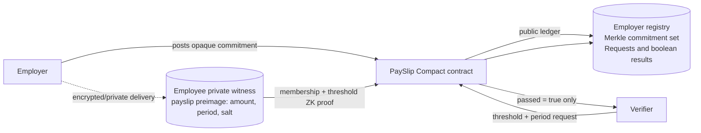

<p align="center"></p>


<p align="center"><strong>Private Payroll. Provable Income. Zero Disclosure.</strong></p>


PaySlip is confidential on-chain payroll where every private payment doubles as a reusable zero-knowledge income credential. An employee can prove they meet a threshold such as “income is at least $1,500 this month” without revealing their salary, employer, transaction history, or a bank statement.

## The problem, then the insight

Stablecoin payroll is global and programmable, but transparent chains publish every salary forever. That lets anyone reconstruct a company’s compensation structure from its payroll wallet. At the same time, employees are asked to overshare bank statements and payslips just to establish one fact for a landlord or lender.

PaySlip treats both as one privacy problem: **the payment is the credential.** A private payslip preimage becomes a locally held credential. The employee later proves a predicate about it, not the data itself.

## Architecture



The public chain records opaque commitments, public verification questions, and a successful boolean result. The employee’s device holds the payslip amount, period, salt, and the Merkle witness. Proof generation validates the private data without putting it on the ledger.

## What is private and what is public?

| Data | Visibility | Why |
| --- | --- | --- |
| Salary amount | Private witness | Never leaves the employee’s device or proof circuit. |
| Employee recipient | Private witness | Not present in the commitment ledger. |
| Payslip period and salt | Private witness | Used only to reconstruct the commitment and prove the predicate. |
| Employer registry | Public | Lets the contract gate who may append payslip commitments. |
| Payslip commitment | Public | A non-reversible hash committed to the ledger. |
| Verification threshold, period, label | Public | The verifier’s requested predicate. |
| `passed = true` | Public | The verifier learns exactly one bit, the predicate holds. |

## Quickstart Guide

### Prerequisites
Before running the application, make sure you have the following installed:
- **Node.js** (v18 or higher) and `npm`
- **Docker** and **Docker Compose** (for running the proof server locally)
- **Compact Compiler** (v0.31.1) (for working with Smart Contracts)

---

### Option A: Zero-Dependency Demo Mode (Ready in under 5 minutes)

The shipped experience defaults to `DEMO_MODE`. It uses a mock provider with deterministic seeded data, realistic ZK proof delays, actual SHA-256 commitments, a below-threshold failure path, and local storage persistence. It is designed to make the full 90-second demo path extremely reliable.

1. **Clone the Repository:**
   ```bash
   git clone https://github.com/CodeWithEugene/PaySlip.git
   cd PaySlip
   ```

2. **Install Dependencies:**
   ```bash
   npm install
   ```

3. **Configure Environment:**
   ```bash
   cp .env.example .env
   ```

4. **Run the Application:**
   ```bash
   npm run dev
   ```

5. **Access the Demo:**
   Open `http://127.0.0.1:5173/?demo=1` in your browser. The application will auto-seed one employer, three employees, two pay runs, and an open `$1,500` July 2026 request. Use the **Reset demo** button in the footer to clean state before starting a fresh run.

---

### Option B: Local Network & Proof Server Setup

To configure the application with the local Midnight proof server:

1. **Start the Proof Server:**
   Ensure Docker is running and start the proof server container:
   ```bash
   docker compose -f docker/proof-server.yml up -d
   ```
   *(Note: If you are on Apple Silicon/ARM, update the image tag to use the community-supported `bricktowers/proof-server` workaround image instead).*

2. **Compile the Smart Contract:**
   Make sure the Compact compiler is installed, then build:
   ```bash
   compact update 0.31.1
   compact compile contracts/payslip.compact contracts/build
   ```

3. **Disable Demo Mode:**
   In `.env`, set `VITE_DEMO_MODE=false` and configure your Midnight testnet endpoint and RPC provider URL.

4. **Run the Frontend:**
   ```bash
   npm run dev
   ```

Suggested video flow:

1. Begin with: “Hi, I’m ___, and this is my demo for the Midnight Hackathon.”
2. Start on `/`, then run payroll on `/employer`.
3. Open `/ledger` to show that commitments, not salaries or names, are public.
4. On `/employee`, use Ada Okafor and `REQ-1042` to generate a successful proof.
5. Open `/verify/REQ-1042` for the `INCOME VERIFIED` result. The verifier never sees a salary number.

Kofi Mensah’s seeded July income is below `$1,500`, providing the graceful failure path. The proof flow shows `Building witness`, `Generating ZK proof`, and `Submitting on-chain` so the user is never left at a dead button.

## Compact contract

The contract lives in [`contracts/payslip.compact`](contracts/payslip.compact). It implements the focused MVP circuit:

1. An employer registers then appends an opaque payslip commitment.
2. A verifier creates a public threshold request.
3. `proveIncome(requestId)` privately receives one payslip preimage and Merkle path.
4. It proves the commitment belongs to the on-chain tree, the period matches, and `amount >= threshold`.
5. It writes only `results[requestId] = true`.

This is deliberately a **single-payslip threshold proof**. Multi-payslip aggregation is roadmap work, not a hidden limitation. The contract was recompiled from source with the checked-in Compact 0.31.1 compiler artifacts:

```bash
compact update 0.31.1
compact compile contracts/payslip.compact contracts/build
```

The generated artifacts include prover and verifier keys for `registerEmployer`, `postPayslip`, `createRequest`, and `proveIncome`.

### Testnet status

The public repository currently ships the complete contract artifacts and a demo-mode frontend. The network provider in [`src/services/midnight.ts`](src/services/midnight.ts) documents the exact Midnight.js / Lace / proof-server integration seam, but it has **not yet been exercised against testnet**, and there is no deployed address or transaction hash to claim. Set `VITE_DEMO_MODE=false` only after wiring that provider with a funded wallet and current testnet endpoints. This is intentional disclosure, not a simulated “testnet” claim.

## Product case and roadmap

Payroll providers, remote-first companies, and stablecoin treasury platforms can pay for confidential global payroll as a premium compliance and retention feature. Employees benefit immediately because the same payment creates a reusable proof of income for rentals, lending, and onboarding. Midnight is necessary because confidentiality and verifiability need to coexist in the contract, rather than being bolted on with off-chain documents.

Next:

- Aggregate multiple payslips across periods in one proof.
- Add shielded token settlement and an employer-funded vault.
- Complete the Midnight.js testnet adapter, deploy, and record transaction references.
- Add an auditor selective-disclosure flow.

## Project layout

```text
contracts/      Compact source and compiled proof artifacts
src/services/   One typed chain-service seam plus the demo provider
public/         Favicon, social image, and web manifest assets
```

## Team and attribution

Built for the **MLH Midnight Hackathon, July 17–19, 2026**, targeting the DeFi track and Midnight’s confidential payroll / proof-of-income use cases.

Licensed under [MIT](LICENSE).
